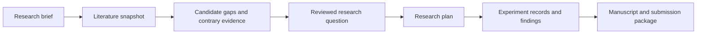

# Research workspace: direction before specification

Status: ready for specification, 27 September 2026. Product defaults are decided; integration feasibility and user-value claims still require validation during delivery.

Canonical map: [Map: evidence-backed AI/ML research workspace to spec readiness](https://github.com/aniketmandloi/blankfolio/issues/1).

This is a decision brief for the next specification, not a build specification. The user delegated decisions without an interview. Product-market fit and researcher acceptance have not been demonstrated.

## Product decision

Build an evidence-backed research workspace for an individual AI/ML researcher preparing a first empirical paper. The initial persona is an undergraduate, master's student, or independent developer with basic Python/ML ability, limited compute, and no reliable research process. Start with empirical predictive ML, with tabular classification as the first evaluation track. Do not market equal gap-discovery quality across every AI/ML subfield until evaluated.

The promise is: turn a broad interest into a defensible, feasible research question and a traceable manuscript. Candidate gaps carry evidence and uncertainty; publication acceptance and universal novelty are not promised.

The product's differentiator is continuity: a literature claim remains connected to the adopted question, experiment plan, recorded finding, and manuscript claim. A search-and-chat interface alone does not satisfy this. Start as an invite-only pilot with no billing: five to ten first-paper researchers and at least one experienced research reviewer. Measure time to an expert-reviewed feasible question/plan, missed prior work, correction burden, and repeat use; paper acceptance is too delayed and confounded to be the initial product metric. This pilot size is a chosen operating plan, not a statistical validation claim.

## Scope and boundaries

The first complete release includes account access; private research projects; scoped literature search; an evidence library; a small candidate-gap shortlist; closest-prior-work comparison; feasibility review; question adoption; a versioned research plan; manual experiment records and artifact uploads; evidence-linked manuscript drafting; Markdown and BibTeX export; and a submission-readiness checklist.

The user brings the Better T Stack starter. Keep the requested stack and adapt its UI after inspecting it. Do not assume its generated packages, dependency versions, auth arrangement, or deployment configuration.

Web first. Expo is a later companion for reading, saving papers, reviewing evidence, and tracking progress. Large literature comparisons and manuscript editing remain web-led initially. Engineering domains beyond AI/ML, automated compute, automatic submission, payments, team collaboration, and a publisher-template marketplace are outside this release.

## Guided experience

1. **Research brief:** collect topic, experience, available compute, time, and desired contribution. Default to a manageable empirical study; constraints influence feasibility rather than silently narrowing the literature claim.
2. **Literature scope:** present queries, source selection, date boundaries, and exclusions. Default to recent work with deliberate inclusion of older foundational papers. Search provenance is visible and editable.
3. **Evidence library:** deduplicate works, show provenance, separate metadata-only from full-text evidence, and let the researcher inspect extracted passages. Papers the user rejects remain recorded with their exclusion reason.
4. **Candidate gaps:** produce at most five candidates, each with a precise question, gap type, supporting anchors, contrary evidence, closest work, search limitations, proposed contribution, feasibility, and next validation step. Fewer supported candidates are preferable to filling a quota.
5. **Gap review:** compare the strongest candidate against the three closest relevant works available in the search, then deliberately search for attempts to answer the same question. Three comparisons are a presentation default, never proof of complete coverage. A candidate can be rejected or revised without losing the evidence.
6. **Adopt a question:** the researcher selects a reviewed candidate, records assumptions and rationale, and defines the intended contribution. The system records a decision; it does not certify novelty.
7. **Research plan:** propose datasets, access/license checks, baselines, splits, leakage precautions, metrics, ablations, reproducibility requirements, resource estimates, and success/failure criteria. Statistical analysis must fit the study rather than use a universal template.
8. **Experiment records:** the researcher conducts experiments outside the app and supplies run conditions, code revision, configuration, seed where applicable, dataset version, metrics, logs, and relevant artifacts. The app tracks completeness and provenance, without claiming the uploaded work was independently reproduced.
9. **Findings and manuscript:** tie findings to experiment records, describe null or negative results honestly, and draft sections with evidence-linked references. Missing results remain explicit placeholders. The researcher can draft an outline early, but export readiness does not invent completed experiments.
10. **Submission package:** export editable Markdown plus verified BibTeX, and provide a venue-specific checklist with policy source and checked date. The researcher checks formatting, disclosure, authorship, anonymization, artifacts, and submission rules. Venue-specific LaTeX/PDF generation is a subsequent feature, not required to validate the initial workflow.

The main workspace has a project overview and focused views for Literature, Gaps, Plan, Experiments, and Manuscript. A progress guide explains the next action and missing evidence. Chat can assist within these views; decisions and artifacts must survive outside chat history. No dense dashboard of arbitrary novelty percentages.

## Evidence rules

Candidate gaps are statements about a bounded search. Gap categories include inconsistent findings, an under-tested condition or population, a methodological limitation, a reproducibility shortfall, and a meaningful efficiency/robustness trade-off. Applying an existing model to another dataset is not sufficient evidence of a contribution by itself.

Separate relevance, evidence strength, and feasibility with an explained qualitative rubric. Do not display a probability of novelty. Distinguish a paper's author-stated future work from the app's own inference.

Every literature-derived factual claim links to an inspected evidence anchor. A source reference alone is insufficient when the claim needs text support. Metadata-only records may support bibliographic facts; abstract-backed claims are labelled as such. They cannot masquerade as inspected methods or results.

Model outputs select only known paper and anchor identifiers. Bibliographies are generated from verified metadata, never from model-invented references. Validation rejects missing identifiers and unsupported factual claims before making an output publishable; semantic support still requires evidence review and evaluation. Prompts alone are not a trust boundary.

Researcher review records support, opposition, assumptions, and limitations. A new search or changed source can make a gap review stale. A revised question or plan marks dependent findings and manuscript sections for review rather than erasing user work.

## Literature access decisions

Choose OpenAlex for discovery and citation expansion, Crossref for DOI reconciliation and known publication updates, and direct arXiv metadata searches for recent preprints. Keep Semantic Scholar disabled by default until the intended product use is covered by its terms. These choices follow the official access and rights documentation captured in [literature sources](../research/literature-sources.md); a provider outage must be visible in the literature snapshot.

Full text is optional per paper, essential for any claim that requires inspecting its methods or results. Fetch and retain a document only when the specific copy permits the intended processing and storage. Start with explicitly permitted open copies and private user uploads covered by an appropriate user attestation and processing policy. User possession alone does not create redistribution rights. Unknown permissions fall back to bibliographic metadata, permitted abstract content, and a source link; the app can still organize research while declaring thinner evidence.

Retain DOI/arXiv/provider aliases and explicit version relationships. Do not merge ambiguous records or silently replace a preprint with the published version. Known retractions/withdrawals invalidate affected support and trigger review; lack of a status flag does not establish that a work has no problems.

## Architecture decisions

| Concern         | Selected default                                                                | Reason and boundary                                                                                                                                                          |
| --------------- | ------------------------------------------------------------------------------- | ---------------------------------------------------------------------------------------------------------------------------------------------------------------------------- |
| App and API     | Next.js web; Node.js Hono with tRPC; one modular backend                        | Web and later Expo use the same application services and contracts. No duplicate business API in Next.js.                                                                    |
| Authentication  | Better Auth, one server configuration                                           | Resolve session and project ownership in every API operation; validate web cookie/CORS/CSRF behavior and native integration separately.                                      |
| Persistence     | Drizzle with PostgreSQL                                                         | Relational provenance, revisions, ownership, review state, and usage accounting.                                                                                             |
| Background work | Separate Node worker; pg-boss backed by the same PostgreSQL                     | Durable jobs with bounded retries, transactionally enqueued work, and idempotent writes. Start with tRPC polling for progress.                                               |
| Files           | Private Amazon S3 behind an object-storage interface                            | Signed, short-lived upload/download access; project-owned keys, verified size/type/checksum. No public document bucket.                                                      |
| PDF extraction  | PDF.js (pdfjs-dist) in the worker, retaining page locators                      | Initial support for born-digital text PDFs. Table extraction requires inspection; scans and low-quality extraction request another source or manual review. OCR is deferred. |
| Model calls     | OpenAI Responses API behind a narrow provider interface                         | Schema-constrained proposals with local evidence-ID checks. Configure capability-compatible model IDs; pin and evaluate before release. No assumed cheapest/latest model.    |
| Retrieval       | PostgreSQL full-text search and filters                                         | Defer pgvector until a measured retrieval failure justifies it. Similarity is not evidence support.                                                                          |
| UI sharing      | Tailwind/shadcn web primitives in packages/ui; separate native components later | Share schemas, types, API client, and applicable domain rules with Expo, not DOM elements.                                                                                   |
| Repo tooling    | TypeScript, Turborepo, Biome, starter's package manager                         | Preserve the supplied template's conventions after inspecting them.                                                                                                          |

These are selected product defaults, with integration gates rather than unmade architecture decisions. See [stack research](../research/stack-architecture.md). PDF.js is an established PDF parsing/rendering platform; extraction fidelity must be evaluated on the product's own corpus. [PDF.js](https://mozilla.github.io/pdf.js/)

Jobs persist execution states (queued/running/succeeded/failed/cancelled) separately from artifact review states. Enqueue with the application write in one database transaction; test that the chosen pg-boss/Drizzle integration truly shares that transaction. Retried stages reuse stable input/version keys. A failed model request must not become a duplicate paid generation or overwrite an accepted artifact. Exactly-once external execution is not assumed. [pg-boss](https://github.com/timgit/pg-boss)

Keep private research artifacts in the application's own stores. Use stateless Responses calls with store=false and bounded extracted text for routine work; provider-side files and hosted retrieval are deferred. This setting disables response storage, but it is not a promise of zero provider retention: abuse-monitoring retention and other feature-specific rules still apply. Make external AI processing visible before private content is sent. [OpenAI data controls](https://developers.openai.com/api/docs/guides/your-data)

Treat papers as untrusted data: embedded instructions cannot alter tool permissions or system behavior. Connector downloads use allowed HTTPS source hosts, bounded redirects, and private-network protections. Parsing runs with resource limits; model outputs cannot execute code or invent arbitrary fetching actions. Enforce project ownership on jobs, source content, artifacts, exports, and signed URL creation.

Default launch limits are engineering policies to validate, not measured requirements: 200 bibliographic records per search run; 20 accepted full-text documents per run; 30 MB and 100 pages per uploaded PDF; 50,000 aggregate model input tokens per bounded generation run; two concurrent research jobs per account. Show truncation and support an explicitly requested scoped follow-up rather than implying complete coverage. Apply source quotas across workers, including arXiv's shared connection/rate limit.

Closed-pilot variable-spend ceilings: $1 per research generation run, $5 per project per month, and $50 globally per month for metered source/model calls. These are chosen limits, not quotations of provider pricing; hosting and storage are budgeted separately. Reserve expected maximum charges atomically before calls, reconcile measured usage, and stop paid work when a limit or provider quota is reached. Unknown pricing disables the affected paid route until configured. Cache by source and artifact version. Provider errors preserve completed evidence and expose retry status without silently repeating paid work.

Keep operational telemetry to job stages, latency, error classes, usage, and coverage outcomes; redact secrets and paper/manuscript text. Account/project deletion cancels jobs, removes private files and extracted content, and records the applicable backup-expiry and external-retention limits rather than promising instantaneous universal erasure.

## Domain and data boundaries

The glossary is [CONTEXT.md](../../CONTEXT.md). Model projects, literature scopes and snapshots, papers and source documents, evidence anchors, candidate gaps and gap reviews, research questions and plan revisions, experiment records and artifacts, findings, manuscript revisions and claim links, and dated venue checklists.

A source document retains external identifiers, version, acquisition route, access/rights status, extracted-text version and content hash. A literature snapshot retains queries, source outcomes, dates, inclusion/exclusion decisions and coverage limits. Candidate gaps reference the snapshot used to create them.

Experiment artifacts are observations; plans are intentions. Findings reference actual experiment records. Manuscript claims reference literature evidence, findings, or clearly labelled hypotheses. These relationships must not be collapsed into one generic document table with unstructured chat as the only history.

Every generated artifact records its inputs, model/provider configuration, prompt version, generation time and validation outcome. Every project artifact is subject to project ownership. Deletion removes private source/artifact content and handles running jobs; shared public bibliographic metadata is separate from private extracted text.

## Quality and validation

A curated fixture set will include supported and contradicted candidate gaps, duplicate paper versions, inaccessible full text, an abstract-only record, a withdrawn/retracted source, an empty search, prompt injection in a document, missing experimental artifacts, a negative result, and a literature update that invalidates a manuscript claim. Start with approximately twenty hand-reviewed cases, which is a development set, not proof of general research accuracy.

Automated acceptance gates: all exported reference identifiers resolve to verified metadata; all literature-derived factual draft claims have evidence links; absent experiment results cannot become observed findings; cross-account reads/writes fail; repeated jobs do not create duplicate records; worker restart preserves jobs; cancelled/deleted projects cannot publish late results; and outages/incomplete searches display their actual coverage.

Human evaluation: reviewers judge whether anchors actually support claims, whether closest work was missed, whether the proposed study is feasible, and whether the guidance changes with resource constraints. Before public launch, require no unsupported critical gap claims in the curated launch set and an explicit review of errors; do not convert this small set into an advertised reliability percentage.

Architecture tests use the API/workflow boundary and deterministic source/model fixtures. Live provider smoke checks test credentials, parse fidelity, latency, and actual cost separately. No tests or servers are needed for this planning artifact.

## Delivery sequence and next-spec inputs

1. Inspect the supplied starter and specify project/auth ownership plus the source ingestion and evidence model.
2. Ship a private vertical slice: research brief → literature snapshot → anchored candidate gap → review and adopted question. Evaluate this before broadening the workflow.
3. Extend that foundation to plans, manual experiment evidence, findings, grounded drafting, and exports.
4. Add venue guidance and a small closed pilot before a public release. Use pilot evidence to adjust scope and interaction design.
5. Plan native companion and additional engineering domains as separate efforts after the web workflow demonstrates value.

Before implementation, validate provider access, document extraction fidelity, job behavior, deployment compatibility, and enforceable spending limits. These are delivery gates with fallback behavior, not reasons to leave product decisions ambiguous. A specification can be authored before credentials exist; a release cannot bypass the integration checks.

## Decision readiness

No unresolved product question blocks the next specification. The canonical decision and evidence records are the map's resolved child tickets; these local documents are working assets. Research branch capture was skipped because this repository has no initial commit; the full findings are preserved in GitHub resolution comments without committing the user's existing untracked setup.

The next specification should cover the first vertical slice and the durable provenance foundation, with later workflow stages named as follow-up increments. Its delivery gates must retain: supplied-template inspection; provider credential/terms checks; supported full-text sample coverage; parser and anchor fidelity; job restart/idempotency; enforced spending reservations; authorization/deletion behavior; and expert review of candidate gaps.

Market differentiation, user usefulness, model accuracy, actual cost/latency, and recall remain hypotheses to measure, not unresolved architecture choices and not established outcomes. If the pilot fails the evidence-quality gates, narrow the supported research track or improve retrieval before adding more features. Deployment vendor and exact dependency/model versions can be selected against the starter and measured integrations without reopening the product map.
